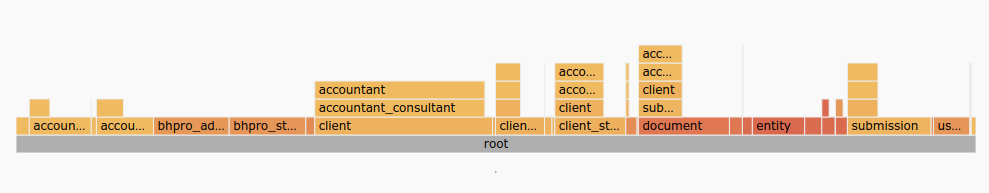
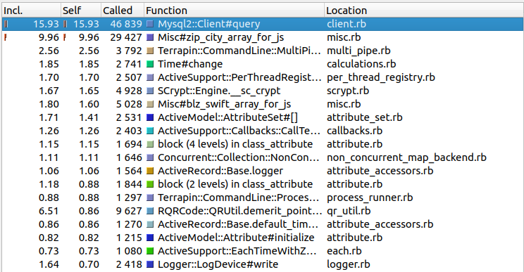

# Задание №8

# Запланированное и невыполненное

Сначала о том, что хотелось сделать, но так и не закончено.

Хотелось сделать полноценную систему CI, чтобы видеть в том числе и регрессии в плане производительности для каждого релиза и PR.

Хотелось наладить централизованный сбор метрик работающего приложения и их визуализацию за некоторый период.

Хотелось повысить видимость вносимых изменений как для разработчиков, так и для администраторов, чтобы не было взаимных сюрпризов.

Эти вопросы пока не особо остро стоят, так как приложение работает с небольшой группой бета-пользователей и основные параметры серверов мониторятся в Zabbix (service heartbeat, cpu, memory, storage). В данный момент акцент делается на скорости разработки.

# Незапланированное и получившееся

Есть несколько пунктов, которые действительно получились достаточно случайно.

Я провел две обобщенных (не мотивированных особой потребностью) оптимизации потребления памяти, что привело с снижению потребления на 12% (разовые замеры и референтное значение на будущее, показатель не мониторится):

- `frozen_string_literal: true` введено глобально;
- Ruby обновлен с `2.4.3` до `2.6.2`.

Под это мы увеличили размер пула для Passenger, ведь появилось пространство для маневра.

Я провел аудит Gemfile, обновил зависимости, выделил отдельную группу `production`, убрал неиспользуемые библиотеки, выделил специализированные зависимости в отдельный группы (например, `rbspy` в группу profiling), чтобы они грузились по требованию (дополнительные группы загружаются при помощи указания в переменной окружения `RAILS_GROUPS` по необходимости).

Вместе с введением кеша для Bundler и настройки `Spring` данный аудит имел два следствия:
- сократилось время развертывания от 20% до 50%;
- сократилось время загрузки приложения в `development` на 300%.

Эти значения пока живут только в виде референтных значений на будущее. Приятным бонусом стало то, что теперь приложение можно запускать локально в `production`.

# Один подробный пример: Оптимизация загрузки статических ресурсов

Имея большой беспорядок в определениях фабрик, я занимался их переопределением, в результате чего получил примеры каскадов почти как в учебнике:



Время выполнения всех тестов также сильно увеличилось. Это подтолкнуло меня к оптимизации времени выполнения всего набора тестов.

Следует отметить, что тесты могут выполняться медленно по двум причинам:
- неоптимально реализованная стратегия тестирования (чрезмерное покрытие, создание излишних экземпляров моделей, обращение к сторонним сервисам при возможности их дублирования и т.д.);
- вызов в тестах неоптимально реализованных участков кода приложения.

Работа над проблемами из второй группы принесет прирост производительности как при выполенении тестов, так и при работе самого приложения.

В качестве `метрики` примем общее время выполнения набора тестов:

``` shellsession
/usr/bin/time -o time_report.txt -a -v bundle exec rspec
```

Первичный анализ проводился с помощью `Stackprof`, который подключался через библиотеку `test-prof`. Метрики собирались на всем наборе тестов в режиме `wall`. Данные сохранены как в исходном формате `StackProf`, так и в `json` и конвертированы `Valgrind/Cacherind`.

Родной визуализатор для `FlameGraph` от `Stackprof` приводит к аварийному завершению браузера, поэтому визуализация осуществлялась средствами `KCacheGrind` и [Speedscope.App](https://www.speedscope.app/).

Изначально статистика по стеку вызовов в относительных значениях выглядела так:



Из этого распределения следует такая последовательность действий:

1. оптимизация работы `Database Cleaner` (запросы к базе обусловлены им)
2. оптимизация кода в библиотеке `misc.rb`
3. замена `PaperClip` по возможности в тестах на заглушки (`Terrapin`)
4. оптимизация использования фабрик, для которых используются пароли (`SCrypt`).

Оптимизация методов в `misc.rb` сводилась к устранению повторяющихся загрузок ресурсов, хранящихся в виде файлов.

Я специально занимался подобными оптимизациями в первую очередь, так как это дало прирост и в скорости прогона тестов, и отражается на производительности всего приложения.
Я не знаю, как соотносится прирост произвоительности приложения и набора тестов из-за этой оптимизации, это зависит от степени покрытия тестами конкретных участков кода. Эти замеры еще предстоит сделать.

Эта единственная оптимизация привела к уменьшению времени тестарования на 2 минуты.

Для защиты этого результата были написаны тесты производительности для подгрупп тестов (тесты с использованием Capybara обрабатываются отдельно) при помощи `RSpec::Benchmark`. Общее время не привышает 9 минут на данный момент.

Конкретно оптимизацией времени прогона тестов (выигрыш около 5 секунд) было условное подключение для `simplecov`, так как подобные отчеты нет смысла генерировать при каждом прогоне тестов.

# Выводы
В качестве общего вывода: производительность приходится "выгрызать" маленькими кусочками в разных местах. В частности же инструментализация анализа производительности и конкретные цифры дают серьезный аргумент в любых дискуссиях о стоимости и необходимости реализации изменений.
